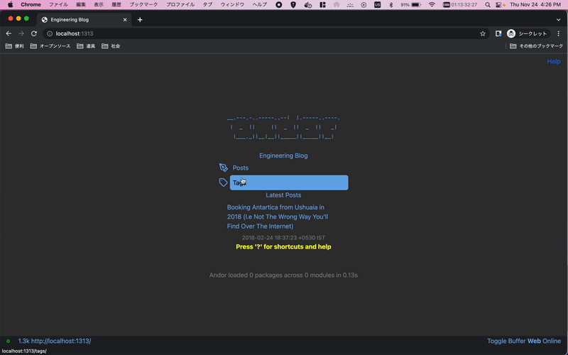
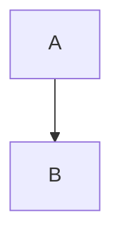
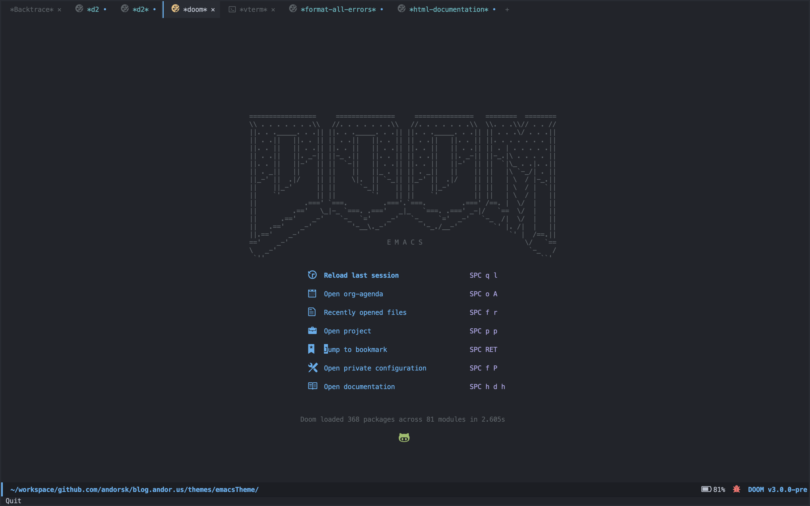

# Hugo Emacs Theme
[](https://choosealicense.com/licenses/mit/)

**Status**: Work in Progess. It works, but there's a lot of tweaking/improvements to do. Recommended to not use in production yet.

**Known Issues:** See [here](#issues) for known issues. 

A hugo theme inspired by Doom Emacs. It contains a doom like theme for hugo and
binds some shortcuts to the browser, such as `?` will bring up a shortcut menu. 

The goal of this theme is to be able to navigate most of the website via keyboard 
bindings as well as through the standard mouse shortcuts.



### Demo

You can see my blog [here](https://andorsk.github.io/blog) using this theme.

### Installation

1. cd into your themes directory
2. git submodule add git@github.com:andorsk/emacsTheme.git
3. change the theme in config.toml to emacsTheme `theme = "emacsTheme"`

### Design Decisions

- Allow someone to navigate entirely by keyboard. Always.
- Should feel free
- Non engineers should be able to use it as well.
- Personally and selfishly, I basically run my life on emacs at this point. I
  wanted to visit my writing and notes on a blog that made it feel like I was
  still in emacs, even when I wasn't.

### Keyboard Bindings

| Key | Action      | Key |   Action    |
|-----|-------------|-----| ------------|
| b   | Open Buffer | ?   | Open Help   |
| m   | Go Home     | p   | Go To Posts |
| t   | Go to Tags  | k   | Scroll Up   |
| j   | Scroll Down | g   | Scroll to Top of Page |
| G   | Scroll to Bottom of Page |  Ctrl + d | Scoll Down Half a Page |
|  Ctrl + u | Scoll Up Half a Page | Enter | Select |

### Features

This theme features a bunch of additional in-build support.

##### mermaid support

This:

```text
graph TD
    A --> B
```

Converts to:



##### MathJax support

If you type in: \$a+b=3\$ you'll get a render of it with MathJax.

##### Custom Blocks

- blockquote
- mermaid
- definition
- theoreom

#### Landing Page

- **Params.art**: The ascii art on the landing page

#### Styling

- Check out main.scss and _variables.scss for styling._

### Issues

See the [here](https://github.com/andorsk/emacsTheme/issues) for known issues.

### Reference



### Contributions

Feel free to send over a PR if you'd like to update this!
