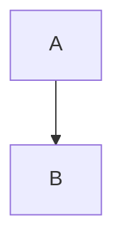

# Hugo Emacs Theme

A hugo theme inspired by Doom Emacs. It contains a doom like theme for hugo and
binds some shortcuts to the browser, such as `?` will bring up a shortcut menu.

### Installation

1. cd into your themes directory
2. git submodule add git@github.com:andorsk/emacsTheme.git
3. change the theme in config.toml to emacsTheme `theme = "emacsTheme"`

### Design Decisions

- Allow someone to navigate entirely by keyboard. Always.
- Should feel free
- Non engineers should be able to use it as well.

### Features

##### mermaid support

##### MathJax support

If you type in: \$a+b=3\$ you'll get a render of it with MathJax.

##### Custom Blocks

- blockquote
- mermaid
- definition
- theoreom

#### Landing Page

- **Params.art**: The ascii art on the landing page

#### Styling

- Check out main.scss and _variables.scss for styling._

### Reference

### Contributions

Feel free to send over a PR if you'd like to update this!
